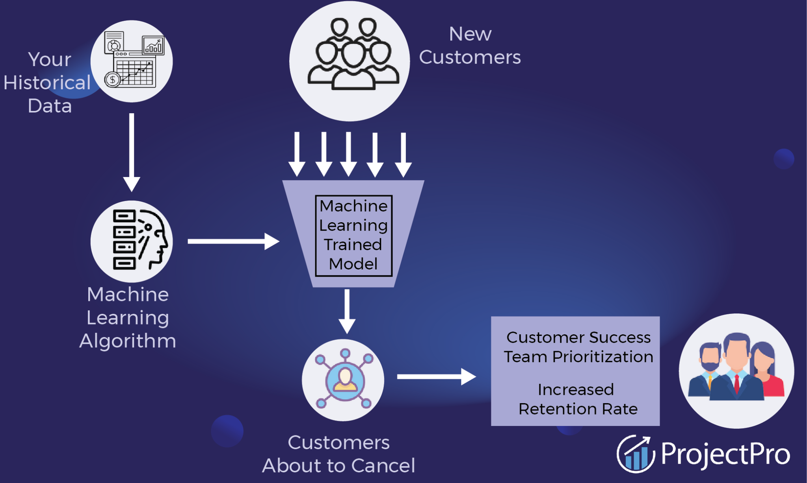
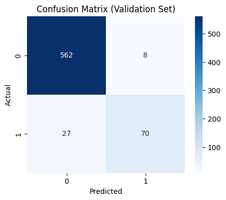
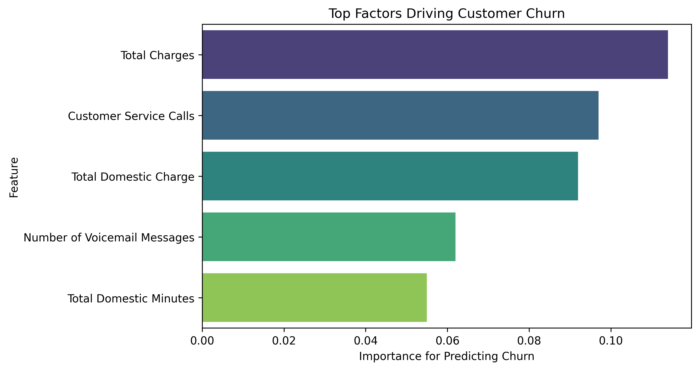

# Akademi (Flatiron School) — Data Science & AI, Cohorte 2025  

# Third Project – Phase 3  

**Student Name**: Micka LOUIS    
**Student Pace**: Self-paced    
**Submission Deadline**: August 24, 2025    
**Instructors' Names**: Wedter JEROME & Geovany Batista Polo LAGUERRE    
**Blog Post URL**: https://github.com/Micka-Louis/ds-project-phase-3.git   

# Project Title  
# Churn Prediction in Telecommunications using Machine Learning  
  

# Overview   
In the telecommunications sector, competition is intense and customers have many options.    
**Churn** (the voluntary cancellation of a subscription) represents a significant loss of revenue for companies and can negatively impact long-term profitability.  

The goal of this project is to build a **machine learning model** capable of predicting whether a customer is likely to churn, in order to identify high-risk profiles and support targeted retention strategies.  

# Business Understanding & Business Problem  
  
**Business Understanding**    
Customer retention is a key strategic issue for telecommunications companies.    
Reducing churn not only increases revenue but also reduces the costs associated with acquiring new customers.    

**Business Problem**    
The company faces a critical question:    
➡️ *Can we identify in advance the customers who are most likely to leave the service?*    

An effective predictive model will enable the business to:    
- Anticipate customer churn.    
- Target marketing actions and loyalty programs.    
- Optimize the allocation of commercial resources.

# 1-Data Understanding  
The data comes from SyriaTel and includes information about their customers. The dataset has customer's state of residence, telephone numbers and length of the account. There are columns indicating if the customer has an international plan and voicemail plan, how many voice mails they receive. The dataset includes how many minutes they spend talking, how many calls they make and how much they are charged during day, evening and night periods.

### Stakeholder Audience   
Telecommunications executives, marketing teams, and customer success managers can leverage this analysis to better understand customer behavior and identify those most likely to churn.  
By leveraging the dataset’s detailed billing, call patterns, and service usage data, predictive models can be developed to support retention campaigns, reduce customer loss, and improve overall profitability.

# 2-Data Preprocessing & Feature Engineering  

- Dropped irrelevant columns: state, phone number, area code
- Encoded categorical variables: international plan and voice mail plan

**Created new features:**  
`total_domestic_minutes`
`total_domestic_calls`
`total_domestic_charge`
`total_charge`

**Handled class imbalance using SMOTE**

**Scaled features for models requiring normalization (e.g., Logistic Regression)**

## Method

- **Data preprocessing:**  
  - Encode categorical features  
  - Scale numeric variables  
  - Balance classes with SMOTE

- **Modeling:**  
  - Logistic Regression, Decision Tree, Random Forest

- **Evaluation:**  
  - **F1-score** chosen as main metric  
    - Balances correctly identifying churners (recall) and avoiding false positives (precision)  
  - Also monitored Accuracy and ROC-AUC

- **Insights:**  
  - Feature importance highlights key drivers of churn  
  - Guides targeted retention strategies

# 3-Modeling Approach

**We explored three classification models:**  

- Logistic Regression – baseline model for churn prediction

- Decision Tree – interpretable model showing feature importance and key thresholds

- Random Forest – ensemble model improving accuracy and stability

The main evaluation metric was F1-score for the churn class, to balance precision and recall, which is crucial for identifying at-risk customers.

# 4-Model Evaluation
**Logistic Regression (F1-focus)**

- **Validation Set:** F1 = 0.49, Precision = 0.42, Recall = 0.59, ROC-AUC = 0.80, Accuracy = 0.82  

- **Test Set:** F1 = 0.43, Precision = 0.35, Recall = 0.57, ROC-AUC = 0.81, Accuracy = 0.79  

Insights: Model detects churn moderately well but struggles with precision due to imbalanced classes

**Decision Tree**

- **Validation Set:** F1 = 0.70, Precision = 0.60, Recall = 0.84, ROC-AUC = 0.87, Accuracy = 0.89  

- **Test Set:** F1 = 0.69, Precision = 0.61, Recall = 0.79, ROC-AUC = 0.85, Accuracy = 0.90  

Insights: Highly interpretable; key features include total_charge and customer service calls  

**Random Forest (Best Model)**  

- **Validation Set:** F1 = 0.80, Precision = 0.90, Recall = 0.72, ROC-AUC = 0.93, Accuracy = 0.95

- **Test Set:** F1 = 0.81, Precision = 0.92, Recall = 0.72, ROC-AUC = 0.87, Accuracy = 0.95

Insights: Best balance between detecting churn and reducing false positives

# 5-Feature Importance (Random Forest)

**Top predictors of churn:**

`total_charge`
`customer service calls`
`total_domestic_charge`
`number vmail messages`
`total_domestic_minutes`

These features indicate that high charges, frequent customer service interactions, and heavy usage patterns are strong signals of potential churn.

# 6-Conclusion

The project aimed to predict customer churn in the telecommunications sector, helping the company anticipate cancellations and implement targeted retention strategies.

After exploratory analysis, preprocessing, and training multiple models (Logistic Regression, Decision Tree, Random Forest), the results show that:

**Random Forest** is the best-performing model, achieving an **F1-score** ≈ 0.80–0.81, accuracy ≈ 0.95, high precision (0.90), and ROC-AUC ≈ 0.87–0.93.

**Accuracy** here means that about 95% of all customers—both churners and non-churners—are correctly classified by the model. However, **F1-score is prioritized because it balances precision and recall for the minority churn class, which is crucial for retention decisions**.

The most influential features for churn prediction are: `total_charge`, `customer service calls`, `total_domestic_charge`, and `number of voicemail messages`.

**Strategic insight:** Customers with high charges and frequent customer service interactions are the highest-risk group. Additional plans, such as voicemail and international services, also significantly influence churn behavior.

The model provides actionable intelligence for targeting high-risk customers and optimizing retention strategies while minimizing false positives.
# 7-Business Recommendations  

## Business Recommendation 1  
**Target High-Charge and High-Service-Call Customers**    

Customers with high total charges or who have contacted customer service more than 3 times are more likely to churn. Implementing personalized offers, discounts, or proactive interventions for this group can help reduce churn.

## Business Recommendation 2  

**Promote Value-Added Services**   

Customers subscribed to additional services (voicemail, international plans) show stronger engagement. Encouraging adoption of these services through promotions or bundles can increase loyalty and reduce churn risk. 

## Business Recommendation 3  
**Enhance Customer Support and Proactive Communication**    

Frequent customer service calls indicate potential dissatisfaction. Providing more responsive support, anticipating issues, and proactively reaching out to at-risk customers can improve satisfaction and retention.

# 6-Next Steps

**Model Deployment**  
Integrate the Random Forest model into the CRM system to generate real-time churn risk scores.  

**Monitoring and Continuous Improvement**  
Regularly collect new customer data, recalibrate the model, and monitor its performance (F1-score, ROC-AUC) to maintain reliability.  

**Segmentation and Targeted Marketing Campaigns**  
Use the model’s insights to create at-risk customer segments and launch personalized retention campaigns tailored to each segment’s specific needs.  

**Exploration of Advanced Models**  
Test other approaches (Gradient Boosting, XGBoost, CatBoost) to compare performance and potentially further improve the F1-score for churners.  

#  Repository Structure   
├── data   
├── images    
├── Final.ipynb  
├── Final.pdf  
├── LICENSE  
├── Presentation.pdf  
└── README.md    
